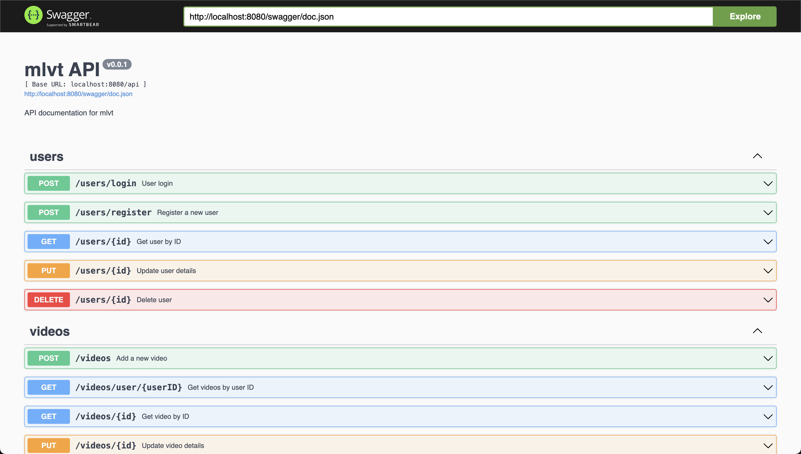

# Project MLVT.

## Table of Contents

- [Project MLVT](#project-mlvt)
  - [Table of Contents](#table-of-contents)
  - [Overview](#overview)
  - [Run Script](#run-script)
  - [Getting Started](#getting-started)
    - [Install Dependencies](#install-dependencies)
    - [Run the Server](#run-the-server)
  - [Feature Documentation](#feature-documentation)
  - [API Documentation](#api-documentation)
  - [Current structure:](#current-structure)
  - [Configuration Details](#configuration-details)
  - [Project Architecture](#project-architecture)
  - [API Testing](#api-testing)
  - [Development](#development)
    - [Adding New APIs](#adding-new-apis)
    - [Wire Generation](#wire-generation)
  - [Localization Support](#localization-support)
    - [Supported Languages](#supported-languages)
    - [Changing the Language](#changing-the-language)
  - [Contributing](#contributing)
  - [License](#license)

## Overview

Project MLVT is a powerful server application designed to provide a comprehensive suite of APIs for managing users, videos, transcriptions, and additional functionalities. The project is structured to handle key operations like user authentication, video management, and file handling through AWS S3 integration.

A key feature of MLVT is the support for presigned URLs, enabling secure upload and download of files such as videos, images, and transcriptions directly to and from AWS S3. This allows for seamless media management in video processing pipelines, including avatar updates, video file uploads, and thumbnail management.

The project follows a modular and scalable architecture, designed with separation of concerns between the repository, service, and controller layers. It includes JWT-based authentication, password management, and role-based access control, making it a secure and extensible foundation for media-related applications.

This document provides detailed guidance on:

- Setup: Instructions on how to configure the project environment, including database and S3 integrations.
- Architecture: A breakdown of the clean, layered architecture with repository, service, and controller layers.
- Development Practices: Best practices followed during the development of the system, with a focus on scalability, maintainability, and security.
- Configuration: Detailed configuration instructions for services such as AWS S3, database connections, and environment variables.
- Execution Instructions: Step-by-step guidance on running the server locally or in a production environment.
- API Documentation: Detailed API documentation with Swagger/OpenAPI support for all user, video, and transcription-related endpoints.
- Localization Support: Support for localization and internationalization, making the platform adaptable for various regions and languages.


## Run Script
For those who prefer not to delve deeper into this project, you can simply execute the `make run-all` command. However, please ensure that you install the release version, as other commits may not be stable enough to support the full functionality of the project.


## Getting Started

### Install Dependencies

```bash
make import
# or
go mod tidy
go mod vendor
```

### Run the Server

You can start the server using:

```bash
make run
# or
cd cmd/server
go run .
```

## Feature Documentation
- [User features](assets/docs/UserFeature.md)
- [Video features](assets/docs/VideoFeature.md)
- [Transcription features](assets/docs/TranscriptionFeature.md)
- [Audio features](assets/docs/AudioFeature.md)
- [Ping features](assets/docs/PingFeature.md)

## API Documentation

The API details are available after running the server at `http://localhost:8080/swagger/index.html`. See `docs/swagger.json` for more details.



For API testing instructions, refer to the [API Testing](#api-testing) section.

## Current structure:
```bash
.
├── assets
│   ├── avatars
│   ├── docs
│   └── videos
├── cmd
│   ├── cleanup
│   ├── migration
│   │   └── migrate
│   │       └── v1
│   ├── seeder
│   └── server
├── docs
├── i18n
├── internal
│   ├── entity
│   ├── handler
│   │   └── rest
│   │       └── v1
│   │           ├── audio_handler
│   │           ├── mlvt_handler
│   │           ├── payment_handler
│   │           │   └── momo_handler
│   │           ├── ping_handler
│   │           ├── progress_handler
│   │           ├── transcription_handler
│   │           ├── user_handler
│   │           └── video_handler
│   ├── infra
│   │   ├── aws
│   │   ├── db
│   │   │   └── mongodb
│   │   ├── env
│   │   ├── reason
│   │   ├── seeder
│   │   ├── server
│   │   │   ├── grpc
│   │   │   └── http
│   │   └── zap-logging
│   │       ├── log
│   │       └── zap
│   ├── initialize
│   ├── pkg
│   │   ├── json
│   │   ├── localization
│   │   ├── middleware
│   │   ├── request
│   │   └── response
│   ├── repo
│   │   ├── audio_repo
│   │   ├── payment_repo
│   │   │   └── momo_repo
│   │   ├── ping_repo
│   │   ├── progress_repo
│   │   ├── transcription_repo
│   │   ├── user_repo
│   │   └── video_repo
│   ├── router
│   ├── schema
│   └── service
│       ├── audio_service
│       ├── auth_service
│       ├── payment_service
│       │   └── momo_service
│       ├── ping_service
│       ├── progress_service
│       ├── transcription_service
│       ├── user_service
│       └── video_service
├── logs
├── migration
└── script

72 directories
```

## Configuration Details

Configuration of the project is managed through environment variables in the `.env` file.

For more details on environment variables, refer to the respective configuration sections under [Environment Configuration](assets/docs/EnvironmentConfiguration.md).

## Project Architecture

* [Three-Layer Architecture](assets/docs/Three-Layer-Architecture.md)
* [Video upload process](assets/docs/VideoUploadProcess.md)
* [Complete project structure](assets/docs/ProjectStructure.md)

## API Testing

* [Core Api Testing](assets/docs/ApiTesting.md)

## Development

### Adding New APIs

When adding new APIs, ensure to add the appropriate annotations before the function. After that, generate the Swagger documentation by running:

```bash
make swag
# or
swag init -g cmd/server/main.go
```

### Wire Generation

To generate the wire files needed for dependency injection, use the following commands:

```bash
make wire
# or
cd cmd/server
wire
```

## Localization Support

This project supports multiple languages for error messages, success notifications, and general information. The localization is implemented using YAML files, stored in the `i18n` directory. Each language has its own YAML file, making it easy to add new languages or update existing translations.

### Supported Languages

- **English** (`en.yaml`): The default language for all messages.
- **Vietnamese** (`vi.yaml`): Translations for Vietnamese users.
- **German** (`de.yaml`): Translations for German users.
- **French** (`fr.yaml`): Translations for French users.
- **Spanish** (`es.yaml`): Translations for Spanish users.
- **Italian** (`it.yaml`): Translations for Italian users.
- **Chinese** (`zh.yaml`): Translations for Chinese users.
- **Japanese** (`ja.yaml`): Translations for Japanese users.
- **Korean** (`ko.yaml`): Translations for Korean users.
- **Portuguese** (`pt.yaml`): Translations for Portuguese users.
- **Russian** (`ru.yaml`): Translations for Russian users.

### Changing the Language

You can change the language of the application by setting the `LANGUAGE` variable in the [Environment Configuration](assets/docs/EnvironmentConfiguration.md). Replace with the appropriate language code from the supported languages list.

## Contributing

We welcome contributions to add more languages, APIs, or improve existing functionalities. Please follow the existing project structure and submit a pull request.

## License

This project is licensed under the MIT License. See the [LICENSE](LICENSE.md) file for more information.